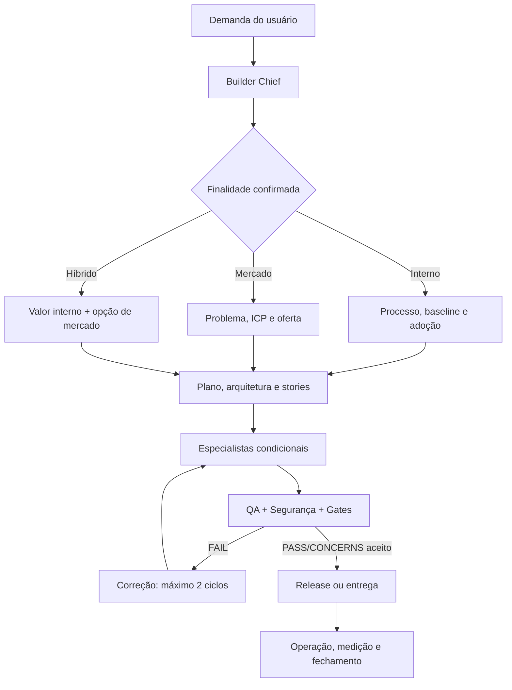

# Builder Squad

**Versão:** 0.9.0-rc.1 — release candidate para piloto fechado.

Um time de agentes especialistas, conectado por workflows, tasks, memória e quality gates, para transformar uma demanda em app, sistema, agente ou automação pronto para uso interno, entrega a cliente ou validação no mercado.

O Builder Squad não é uma coleção de prompts. É um sistema operacional de projetos:

- 1 Builder Chief como porta única;
- 15 especialistas com fronteiras claras;
- 75 tasks atômicas;
- 12 workflows condicionais;
- 36 templates canônicos;
- 31 quality gates;
- 9 automações de governança;
- adapters para Codex e Claude Code;
- CLI portátil sem dependência externa de runtime.

## A primeira decisão muda toda a esteira

Todo briefing começa perguntando:

> Este projeto é para uso interno, para colocar no mercado ou começa interno com intenção futura de venda?

Essa não é uma pergunta cosmética:

- **Interno:** exige baseline do processo, ROI, adoção, owner operacional e continuidade.
- **Mercado:** exige evidência do problema, ICP, monetização, analytics, segurança, suporte e go-to-market.
- **Híbrido:** entrega valor interno sem bloquear uma evolução futura para identidade externa, multi-tenancy, separação de dados, licenciamento e billing.

## Como o sistema opera



O Builder Chief escolhe o menor conjunto seguro de especialistas. Interface ativa UX e frontend; dados ativam arquitetura de dados; IA ativa arquitetura de agente e evals; integrações ativam resiliência; pagamentos e produção pública forçam segurança, release e aprovação humana.

## Instalação rápida

Pré-requisito: Node.js 18+ e Git.

```bash
npm run doctor
npm test
node scripts/install.mjs --adapter codex --target /caminho/do/projeto
```

Para Claude Code, use `--adapter claude-code`. O instalador cria `.builder-squad/` dentro do projeto e não sobrescreve `AGENTS.md` ou `CLAUDE.md` existentes.

## Primeiro projeto

Você pode ativar o Builder Chief no seu ambiente ou testar o motor de rota:

```bash
npm run route -- --purpose market --features ui,data,backend,ai,payments --public-production
```

Para inicializar a memória canônica:

```bash
npm run init:project -- \
  --name "Meu Produto" \
  --purpose market \
  --features ui,data,backend,ai \
  --request "Criar um produto que resolve..."
```

O projeto recebe `project.yaml`, `status.yaml`, `brief.md`, `route.json`, histórico, decisões, handoffs e evidências.

## Comandos

| Comando | Resultado |
|---|---|
| `validate` | Confere cobertura, contratos e referências |
| `doctor` | Confere ambiente e integridade |
| `route` | Simula workflow, agentes, gates e complexidade |
| `init` | Inicializa um projeto isolado |
| `status` | Exibe o estado canônico |
| `transition` | Aplica transição legal e auditável |
| `handoff` | Cria handoff autocontido e verifica segredos |
| `install` | Instala sidecar Codex ou Claude Code |
| `package` | Gera pacote com checksums SHA-256 |

Use `node scripts/builder-squad.mjs help` para a lista atual.

## Guardrails

- Ações destrutivas, produção, publicação, mensagens externas, gastos, segredos, mudanças materiais e aceite jurídico exigem aprovação humana.
- Gates só emitem `PASS`, `CONCERNS`, `FAIL` ou `BLOCKED`.
- Um `FAIL` retorna ao owner da causa; após dois ciclos sem resolver, o projeto é bloqueado e replanejado.
- Nenhum handoff depende apenas da conversa.
- Prova social, urgência, escassez, participantes ou presença ao vivo jamais podem ser fabricados.
- O squad não substitui profissionais jurídicos, médicos, contábeis ou de segurança quando a decisão exigir habilitação formal.

## Estrutura

```text
agents/       papéis e fronteiras dos 16 agentes
tasks/        contratos das 75 tarefas
workflows/    12 esteiras condicionais
templates/    36 artefatos canônicos
checklists/   31 quality gates
automations/  eventos, efeitos, guardas e auditoria
data/         ontologia, roteamento e máquina de estados
schemas/      contratos legíveis por máquina
scripts/      CLI, validação, instalação e empacotamento
adapters/     integração com Codex e Claude Code
examples/     projetos de referência
docs/         PRD, arquitetura, guias, stories e relatórios
```

## Comece aqui

1. [Quickstart](docs/guides/QUICKSTART.md)
2. [Ciclo de vida](docs/guides/PROJECT-LIFECYCLE.md)
3. [Referência de rotas](docs/guides/ROUTING-REFERENCE.md)
4. [Comandos](docs/guides/COMMANDS.md)
5. [Customização](docs/guides/CUSTOMIZATION.md)
6. [Troubleshooting](docs/guides/TROUBLESHOOTING.md)
7. [Compatibilidade](docs/guides/COMPATIBILITY.md)
8. [Dados e segurança](docs/guides/DATA-AND-SECURITY.md)
9. [Release notes 0.9.0-rc.1](docs/release/RELEASE-NOTES-0.9.0-rc.1.md)

## Validação atual

- Testes automatizados: 21/21.
- Validações estruturais: 20/20.
- Agents → tasks: 75/75 referências.
- Blueprint → workflows: 12/12.
- Licença: proprietária, consulte [LICENSE.md](LICENSE.md).
